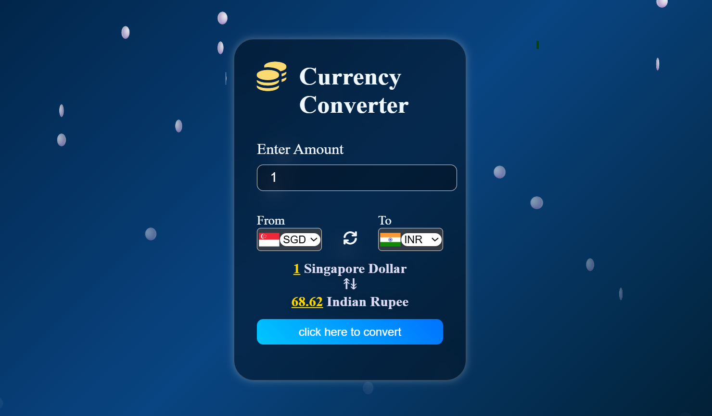

# Currency Converter App
Currency Converter is a web app built using HTML, CSS, and JavaScript, using real-time exchange rate.

## 📸Screenshot 

## ☣️ Features :
- Converts currencies between different countries.
- Real-time exchange rates powered by API.
- Falling coins animation in the background.

## 🔗 Live Demo
[Try it here](https://codebygunjan.github.io/Currency-Converter/) 

## ⚙️ Technologies Used :

- HTML
- CSS 
- JavaScript
- External API (for currency rates)

## 💡How to use :
1. Clone this repository
- git clone: https://github.com/codebygunjan/Currency-Converter.git
2. Open `index.html` in your browser.
3. Enter an amount, select currencies, and click "Get Exchange Rate."

## 📄 License :
- This project is licensed under the MIT License.

## 🍂 Author :
Gunjan Harkesh Khudaniya!